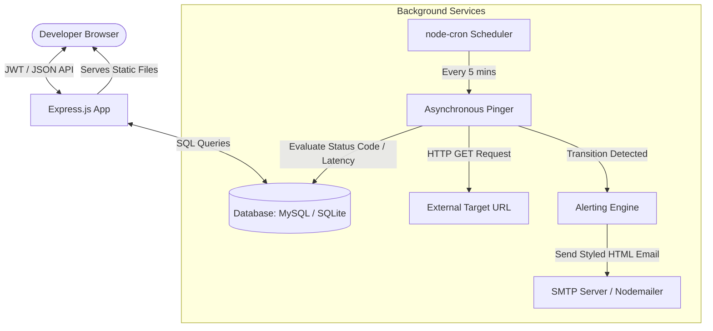

# API Uptime Monitor (UptimePulse)

A premium, full-stack incident monitoring platform similar to UptimeRobot or Better Uptime. Built from scratch with a robust Express.js backend, background cron scheduling, automated email alerting, database state transition logic, and a stunning vanilla HTML/CSS/JavaScript single-page application (SPA) dashboard featuring glassmorphic dark/light aesthetics.

This project was built as a backend portfolio showcase to demonstrate database schema design, periodic cron jobs, asynchronous HTTP requests, authentication, and integration testing.

---

## 🚀 Key Features
1. **JWT User Authentication**: Registration and Login flows. Each developer manages their own secure dashboard of monitors.
2. **Endpoint Management**: Add, pause, resume, edit, or delete monitored HTTP/HTTPS URLs with custom nicknames.
3. **Background Ping Scheduler**: Powered by `node-cron`, checking service status every 5 minutes (or 1 minute in demo mode) with request timeouts.
4. **Intelligent State Transitions**: Detects transitions (UP ↔ DOWN) to prevent spam alerts. It triggers downtime incidents only when status changes.
5. **Automated Alerting Engine**: Beautifully formatted HTML emails sent via `Nodemailer` when a monitor goes DOWN (stating error reasons) and when it comes back UP (calculating total downtime duration).
6. **Live Analytics & Charts**: Responsive grids showing status badges, live uptime ratios, average response time, and detailed latency line graphs (via `Chart.js`).
7. **Incident Audits**: Timelines tracking historical outages, exact recovery times, durations, and root-cause error details.
8. **Dual-Database Support**: Transparent configuration switcher in `.env` to swap between zero-config local **SQLite** (immediate developer startup) and production-grade **MySQL**.

---

## 🏗️ System Architecture



---

## 🗄️ Database Schema

The database consists of 4 main tables. Foreign keys ensure cascading deletions so that deleting a monitor automatically removes all its check metrics and downtime records.

### 1. `users`
Tracks registered accounts and credentials.
- `id` (INT, Primary Key, Auto-Increment)
- `name` (VARCHAR) — User display name
- `email` (VARCHAR, Unique) — Login email
- `password_hash` (VARCHAR) — Hashed password using `bcryptjs`
- `created_at` (TIMESTAMP)

### 2. `monitors`
Stores user-configured endpoints and current state.
- `id` (INT, Primary Key, Auto-Increment)
- `user_id` (INT, Foreign Key referencing `users.id`)
- `name` (VARCHAR) — Friendly nickname
- `url` (VARCHAR) — Endpoint address
- `status` (VARCHAR) — Current check status (`UP`, `DOWN`, `PENDING`)
- `is_active` (TINYINT/BOOLEAN) — Toggle to pause/resume checks
- `last_checked` (TIMESTAMP, Nullable)
- `created_at` (TIMESTAMP)

### 3. `checks`
A high-frequency logs table containing individual ping performance details.
- `id` (INT, Primary Key, Auto-Increment)
- `monitor_id` (INT, Foreign Key referencing `monitors.id`)
- `status` (VARCHAR) — Check outcome (`UP`, `DOWN`)
- `status_code` (INT, Nullable) — HTTP response status code
- `response_time_ms` (INT, Nullable) — Response latency in milliseconds
- `error_message` (TEXT, Nullable) — Details of TCP timeouts or connection failures
- `timestamp` (TIMESTAMP)

### 4. `incidents`
Tracks outages and duration logs.
- `id` (INT, Primary Key, Auto-Increment)
- `monitor_id` (INT, Foreign Key referencing `monitors.id`)
- `down_time` (TIMESTAMP) — Start of the outage
- `up_time` (TIMESTAMP, Nullable) — Timestamp of resolution
- `error_message` (TEXT, Nullable) — Cause of the downtime
- `duration_minutes` (INT, Nullable) — Total calculated downtime duration in minutes

---

## 🛠️ Tech Stack
*   **Backend**: Node.js, Express.js
*   **Database Client**: `mysql2` (Promise pools) or `sqlite3`
*   **Cron Job Service**: `node-cron`
*   **Email Engine**: `nodemailer`
*   **Security**: `jsonwebtoken` (session encryption), `bcryptjs` (password hashing)
*   **Frontend**: Vanilla HTML5, CSS3 (variables, transitions, animations), Vanilla JavaScript (AJAX Fetch API, Chart.js, Lucide Icons)

---

## 💻 How to Run Locally

Follow these steps to set up and run the project locally on your machine.

### Step 1: Install Dependencies
Open your command terminal (PowerShell, Command Prompt, or bash) in the project directory and run:
```bash
npm install
```

### Step 2: Configure Environment Variables
Copy `.env.example` to a new file named `.env`:
```bash
copy .env.example .env
```
Open the `.env` file and review settings:
- **Zero-Config SQLite (Recommended for instant testing)**: Keep `DB_TYPE=sqlite`. The project will automatically create a local `uptime_monitor.sqlite` file and build tables.
- **MySQL Integration**: Set `DB_TYPE=mysql`, and fill in `DB_HOST`, `DB_USER`, `DB_PASSWORD`, and `DB_NAME` matching your local database config. Run `schema.sql` inside your MySQL client to build the tables.

### Step 3 (Optional): Setup SMTP Credentials
To test actual email alerts, create a free developer account on [Mailtrap](https://mailtrap.io). Mailtrap provides a mock SMTP server where you can safely intercept emails.
Copy the SMTP host, port, username, and password credentials and insert them into your `.env`:
```env
SMTP_HOST=sandbox.smtp.mailtrap.io
SMTP_PORT=2525
SMTP_USER=your_mailtrap_user_id
SMTP_PASS=your_mailtrap_password
```
*(If you leave the credentials unconfigured or set to `mock_user`, the backend will output alerts to the terminal console instead of crashing).*

### Step 4: Run Integration Tests
Verify database connections, password hashing, and endpoint check logic by running:
```bash
npm test
```
This script validates backend endpoints by simulating checks on a real UP site (`https://httpstat.us/200`) and a DOWN site (`https://httpstat.us/500`) and prints diagnostics.

### Step 5: Start the Local Development Server
Boot up the web application:
```bash
npm run dev
```
Open your browser and navigate to:
```
http://localhost:3000
```
Register an account, create a monitor, and test toggles!

> [!TIP]
> **Developer Demo Mode (1-minute pings)**:
> In the `.env` file, add `CRON_INTERVAL_1M=true`. The background scheduler will ping monitors every **1 minute** instead of 5 minutes. This is perfect for live grading or demonstrating alerts.

---

## ☁️ Deployment Guide (Railway)

Railway is an excellent platform for Node.js + MySQL deployment because it spins up databases and servers easily in the same workspace.

### Step 1: Push your project to GitHub
Initialize git and commit your files, then push to a private or public GitHub repository. Make sure your `.gitignore` contains `node_modules` and `.env`.

### Step 2: Create a MySQL Database on Railway
1. Log in to [Railway.app](https://railway.app).
2. Click **New Project** → **Provision MySQL**.
3. Railway will spin up a MySQL service. Go to the variables tab of the MySQL database service to view host, port, user, password, and database credentials.

### Step 3: Deploy the Node.js Server
1. In your Railway dashboard, click **New** → **GitHub Repo** and connect your repository.
2. Railway will automatically detect the Node.js project and deploy it.
3. Once created, go to the server service settings and click **Generate Domain** to get a public HTTP URL.

### Step 4: Map Environment Variables
Navigate to the **Variables** tab of your deployed Node.js service on Railway, and add the following variables:
*   `PORT` = `3000`
*   `DB_TYPE` = `mysql`
*   `DB_HOST` = `${{MySQL.MYSQLHOST}}` *(Railway auto-binds connection details)*
*   `DB_PORT` = `${{MySQL.MYSQLPORT}}`
*   `DB_USER` = `${{MySQL.MYSQLUSER}}`
*   `DB_PASSWORD` = `${{MySQL.MYSQLPASSWORD}}`
*   `DB_NAME` = `${{MySQL.MYSQLDATABASE}}`
*   `JWT_SECRET` = `choose_a_strong_random_key_here`
*   `SMTP_HOST`, `SMTP_PORT`, `SMTP_USER`, `SMTP_PASS` = *(Your Mailtrap or production SendGrid/Gmail SMTP credentials)*

Railway will automatically redeploy the server with the environment variables. The database connections will bind, and the background pinger will run continuously in the cloud!
